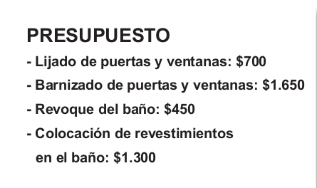

## Semana 6
### Problemas 2 ;)
1. Julio hizo un trabajo y cobró $4.040. Por el mismo trabajo, Alberto cobró $4.400. ¿Cuál de los dos cobró más?

2. Para arreglar la casa, María le pidió presupuesto al albañil:

   

  a) ¿Cuánto dinero va a gastar María si decide hacer todos los arreglos?

  b)¿Y si decide dejar el barnizado de puertas y ventanas para otro momento? 

3. En el baño de la casa de María, hay 6 filas de 8 baldosas cada una.

  a) Si quiere comprar baldosas nuevas del mismo tamaño, ¿cuántas debe comprar? _____________

  b) Si cada baldosa sale $10, ¿cuánto dinero va a gastar? _________________
  
4. En un comercio mayorista, tienen los siguientes precios.

|LISTA DE PRECIOS|
|:--------------:|
|BUZOS: $25|
|PANTALONES: $70|
|MEDIAS: $8|
|PULÓVERES: $60|
|REMERAS: $20|

a) Camila compró para su negocio 6 panta lones, 10 remeras y 5 buzos. Mirando la lista de precios, calculá cuánto dinero gastó.

b) Mauro quiere comprar dos pulóveres, dos pantalones y 3 remeras. ¿Le alcanzará con $300? ¿Le falta o le sobra dinero? ¿Cuánto?

c) Después de pagar con $100, a Mirta le dieron $30 de vuelto. ¿Qué pudo haber comprado? ¿Hay una sola posibilidad?