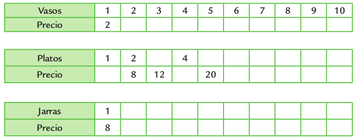

## Semana 7
### Problemas 3 ^_^
1. Un paquete de yerba cuesta $6. ¿Cuánto gasta una persona que compra 3 paquetes? ____________
2. Un par de medias cuesta $9. Martina compró 4 pares y pagó con $50. ¿Le tienen que dar vuelto?¿Cuánto? _________________
3. Mauro tiene 5 años, y su hermano tiene el triple. ¿Cuál es la cuenta que permite saber la edad del hermano de Mauro?

  - 5 + 3
  - 5 x 3

4. El siguiente dibujo representa un patio de forma rectangular construido con baldosas cuadradas:

  

  Sin contar las baldosas, decidí con cuál de estos cálculos es posible saber cuántas baldosas hay:

  - 7 + 5
  - 7 – 5
  - 7 × 5

5. Cada cuadro muestra la relación entre cantidad de artículos y sus precios en pesos.

  

  a) Completalos.

  b) ¿Se pueden encontrar los resultados de estos cálculos en las tablas que completaste? Marcá con una cruz los que sí se pueden encontrar.

6. Resolver las siguientes multiplicaciones haciendo la cuenta parada.

  - a) 34 x 4 = __________ e)  589 x 2 = __________
  - b) 34 x 5 = __________ f) 743 x 3 = __________
  - c) 125 x 6 = __________ g) 971 x 4 = __________
  - d) 157 x 8 = __________ h) 149 x 9 = __________

